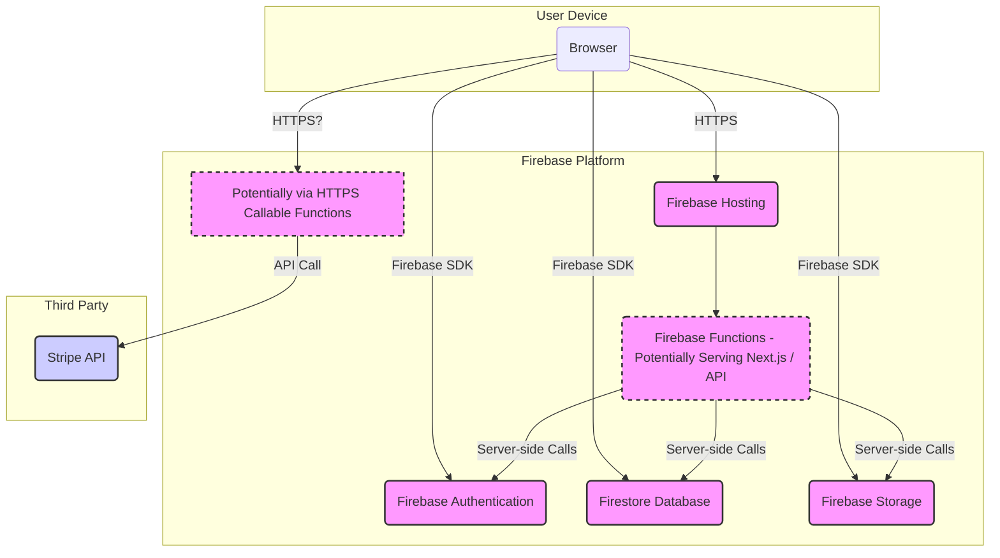
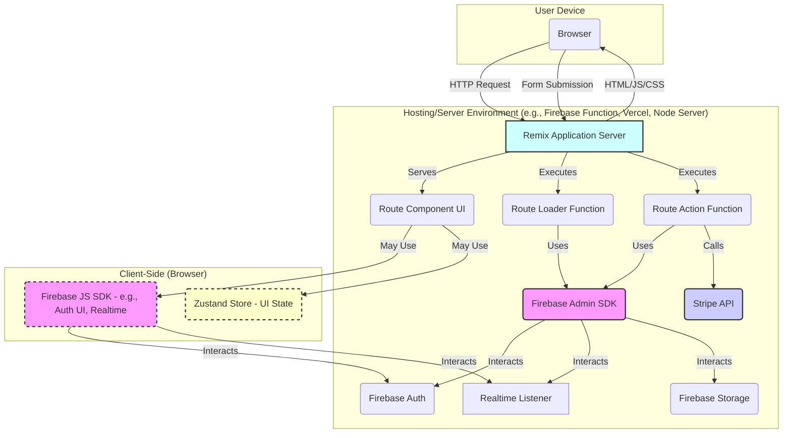

# Architecture Analysis: Next.js vs. Remix Exploration (2025-04-03)

This document summarizes the architectural analysis of the current FOH-Pro Next.js application and explores the potential implications of rewriting it using Remix, including deployment strategies on Firebase.

## 1. Current Next.js Application Architecture

Based on analysis of the project files (`package.json`, `next.config.js`, `firebase.json`, `src/` structure, `functions/src/index.ts`):

*   **Frontend Framework:** Next.js (using Pages Router) with React and TypeScript.
*   **UI:** Tailwind CSS with Shadcn UI components (built on Radix UI).
*   **State Management:** Zustand.
*   **Backend Services:** Firebase Platform
    *   Firebase Authentication (likely client-side SDK focus).
    *   Firestore Database.
    *   Firebase Storage.
    *   Firebase Functions (configured in `firebase.json` pointing to `functions/` dir, but `functions/src/index.ts` is currently empty/undeveloped).
*   **Integrations:**
    *   Stripe (dependency present, suggesting planned payment integration, likely requiring backend functions).
    *   Storybook for component development/testing.
    *   Jest & Cypress for testing.
*   **Deployment:** Configured for Firebase Hosting.
    *   **Ambiguity:** `firebase.json` points hosting `public` to `"out"`, suggesting a static export (`next export`). However, the `deploy` script in `package.json` uses `next build` (not `export`), and `next.config.js` doesn't specify `output: 'export'`. This indicates uncertainty about the exact deployment model (Static vs. SSR/ISR served via Functions/Cloud Run).
    *   Firebase Emulators are configured for local development.

### High-Level System Overview (Current)



## 2. Remix Rewrite Exploration

Rewriting the application using Remix would involve significant architectural shifts:

*   **Routing:** Move from `src/pages` to `app/routes`. Leverage Remix's nested routing capabilities. Routes co-locate component, `loader`, and `action`.
*   **Data Loading:** Shift from Next.js methods (client-side fetch, `getServerSideProps`, etc.) to Remix `loader` functions executed server-side before component render. Data accessed via `useLoaderData`. Primarily use Firebase Admin SDK here.
*   **Data Mutations:** Move from client-side handlers to Remix `action` functions triggered by form submissions (POST/PUT/DELETE). Actions handle server-side logic (e.g., Firestore updates via Admin SDK, Stripe calls). Remix manages pending states and revalidation.
*   **UI Components (Shadcn):** Largely reusable within Remix route components.
*   **Styling (Tailwind):** Similar setup, configured via `tailwind.config.js` and imported typically in `app/root.tsx`.
*   **State Management (Zustand):** Need for managing *server* data state client-side is reduced due to `loader`s. Still useful for pure UI state or complex non-server state.
*   **Authentication:** Likely involves client-side Firebase JS SDK for UI interaction (login form), server-side Firebase Admin SDK in `action` functions to verify credentials/create sessions, and server-side session verification in `loader` functions for protected routes using Remix session management.
*   **Firebase Integration:** Shift focus from client-side JS SDK to server-side Admin SDK within `loader`s and `action`s. Reduces the need for separate simple CRUD Firebase Functions, as logic can live in Remix actions. Complex background tasks might still need separate Functions.

### Conceptual Remix Architecture



## 3. Remix Deployment on Firebase Functions

A viable strategy to keep the deployment within the Firebase ecosystem:

*   **Concept:** Use Firebase Hosting for static assets (CDN) and rewrite all dynamic requests to a single HTTP V2 Firebase Function that runs the Remix server logic (via an adapter like `@remix-run/express`).
*   **Configuration:**
    *   `firebase.json`: Configure `hosting.rewrites` to point `source: "**"` to the function (e.g., `"function": "remixApp"`). Set `hosting.public` to Remix's client build output directory (e.g., `build/client`). Configure the `functions` entry.
    *   `functions/src/index.ts`: Create an Express app, use `createRequestHandler` from `@remix-run/express` with the Remix server build (`import * as build from "../build/server"`), and export the Express app using `onRequest`.
*   **Build Process:** Requires building both Remix (`remix build`) and the Firebase Function code (`npm run build --prefix functions`). Careful path management or copying of the Remix server build (`build/server/`) is needed so the function can import it.
*   **Pros:** Single ecosystem, leverages Hosting CDN, auto-scaling via Functions.
*   **Cons:** Potential for Cloud Function cold starts, subject to function limits, slightly more complex build artifact management.

### Request Flow Diagram (Remix on Firebase Functions)

```mermaid
graph TD
    User[User Browser] -- Request /dashboard --> Hosting[Firebase Hosting]
    Hosting -- Asset Request /build/app.js --> CDN[Hosting CDN]
    CDN -- Serves Static File --> User
    Hosting -- Dynamic Request /dashboard --> Rewrite[Hosting Rewrite Rule (**)]
    Rewrite -- Triggers --> Func[Firebase Function (remixApp)]
    Func -- Runs --> Remix[Remix Server (via Adapter)]
    Remix -- Generates Response (HTML) --> Func
    Func -- Returns Response --> Hosting
    Hosting -- Returns Response --> User